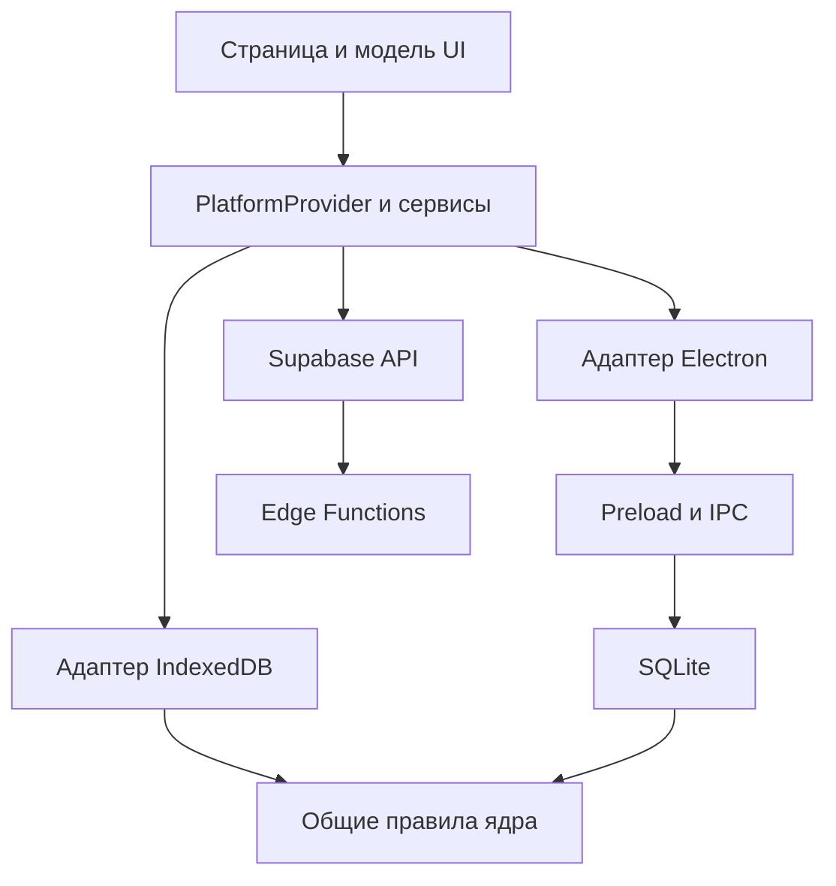

# Архитектура

В LioraLang один интерфейс и два способа работать с локальными данными. Браузер использует IndexedDB, Electron использует SQLite. Правила карточек, импорта, SRS и синхронизации вынесены в общий код, чтобы результаты на платформах не расходились.

## Слои приложения

| Слой | Ответственность |
| --- | --- |
| `src/app/` | Запуск, маршруты, общий layout, подключение провайдеров |
| `src/pages/` | Сборка конкретной страницы |
| `src/widgets/` | Крупные части страницы: обучение, редактор, настройки, прогресс |
| `src/features/` | Действия пользователя: оценить, импортировать, добавить, сгенерировать |
| `src/entities/` | Представление и модели сущностей интерфейса |
| `packages/shared/src/` | Общие компоненты, конфигурация, чистое ядро, API и платформенные адаптеры |
| `electron/` | Процесс Electron, preload, IPC, база, системные операции |
| `supabase/` | Миграции и серверные функции |

Импорты направлены сверху вниз: app, pages, widgets, features, entities, shared. Модуль открывает публичный API через `index.js`. Shared не импортирует UI верхних слоёв; его ядро не зависит от React, IndexedDB или Electron.

Исключение по назначению, а не по платформе: общий код API и адаптеров находится в shared, но компоненты не вызывают его напрямую. Они получают сервис через провайдер.

## Запуск и выбор платформы

`src/main.jsx` запускает приложение. `src/app/App.jsx` подключает окружение и маршрутизацию. `PlatformProvider` находится в `packages/shared/src/providers/PlatformProvider/`.

Vite выбирает платформу по `VITE_APP_TARGET`. Алиас `@platform-target` ведёт в `packages/shared/src/platform/target/web.js` или `desktop.js`. Алиас `@app-router-routes` выбирает маршруты web или desktop.

Web использует абсолютную базу `/`, десктоп относительную `./`. В web есть лендинг, локализованные страницы и публичный переход по ссылке колоды. Десктоп начинает с обучения. Общие страницы находятся под `/app/`.

## Доступ к данным

В UI используйте `usePlatformService` из `@shared/providers`. Например:

```jsx
import { usePlatformService } from "@shared/providers";

const deckRepository = usePlatformService("deckRepository");
```

Дальше модель вызывает метод репозитория и обрабатывает загрузку, результат и ошибку. Компонент не должен знать, хранится запись в IndexedDB или SQLite. Контракт всех сервисов перечислен в [описании двух платформ](architecture-dual-platform.md).



Стрелки показывают обращения и использование правил. Ядро не обращается обратно к адаптерам.

## Данные и предметы

Колода хранит имя, описание, теги, идентичность для синхронизации и настройки предмета. Запись хранит `source`, `target`, дополнительные общие поля и `subjectFields`. В коде и базе записи исторически называются `words`, даже когда содержат задачи или вопросы.

Профиль предмета задаёт поля, подписи сторон, направления, возможности ИИ, доступность Hub и композицию карточки. Реестр находится в `core/usecases/subjects/registry.js`. Технология уточняет внешний вид программирования через каталог оформлений, а не через новый тип записи.

`buildCardPresentation()` собирает блоки из профиля; Flashcard сопоставляет тип блока с компонентом. Языковой путь поддерживает прежний рендер. [Подробнее о расширении](learning-objects.md).

## Основные потоки

### Сохранение колоды

Форма собирает данные и нормализует поля по профилю. Репозиторий сохраняет колоду и записи, пересчитывает идентичность содержимого и уведомляет подписчиков. В новой колоде из окна генерации выбранные черновики и колода сохраняются одним вызовом `saveDeck`.

### Повторение

Репозиторий читает карточки и журнал. Общий движок строит очередь и превью интервалов. При оценке хранилище проверяет профиль и revision, затем в одной транзакции записывает расписание и событие ответа. UI переходит дальше только после успешной записи. [Подробнее о SRS](srs.md).

### Синхронизация

Общий `createSyncRepository` сравнивает локальные хэши с последним известным состоянием сервера. Пакеты колод и изображения передаются отдельно от событий повторений. Адаптеры локального хранения сохраняют очередь и состояние профиля. [Хранение, конфликты и восстановление](platforms-and-storage.md).

### ИИ

UI проверяет настройки, сессию и сеть, затем вызывает `wordSuggestRepository`. Supabase Edge Function проверяет пользователя, лимит и запрос, обращается к Gemini и проверяет ответ. Результат остаётся предложением до применения. [Контракты и ограничения](word-suggestions.md).

## Electron

`electron/main.js` собирает модули из `electron/main/`. Жизненный цикл окна, меню, импорт, резервные копии, OAuth, обновления и IPC разделены. `electron/preload.cjs` открывает ограниченный API для renderer.

SQLite и файловые операции выполняются в main. У окна включён `contextIsolation`, отключён `nodeIntegration`. Доступ к `window.electronAPI` разрешён адаптерам и инфраструктуре, но не страницам и виджетам.

## Сборка и проверки

Страницы загружаются через lazy routes. Web SRS и статистика также подключаются по требованию. Web-сборка создаёт манифест ресурсов для service worker и статические страницы лендинга через SSR и prerender.

Проверки границ выполняются `check:boundaries` и `check:layers`. ESLint проверяет код и React hooks. Наличие установленного пакета проверки FSD само по себе не означает, что он включён в ESLint: фактические правила задают конфигурация и скрипты проекта.

[Команды и окружение](onboarding.md) · [Карта модулей](module-catalog.md) · [Правила кода](../rules/code-and-components-rules.md)
