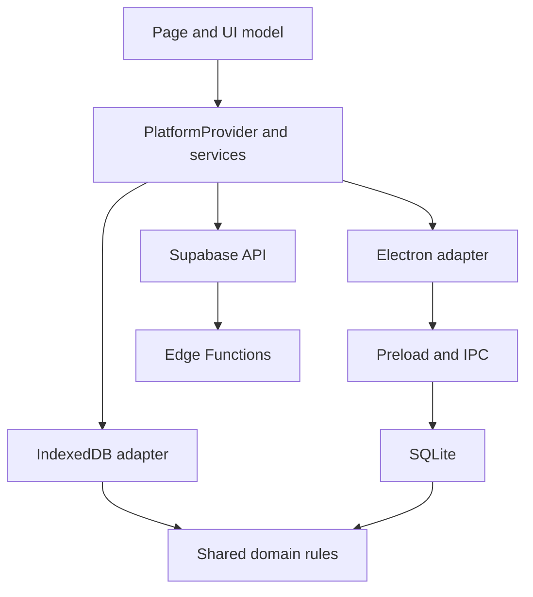

# Architecture

**English** | [Русский](architecture.ru.md) | [Polski](architecture.pl.md)

Liora has one interface and two local storage implementations: IndexedDB in the browser and SQLite in Electron. Card rules, import, SRS and sync use shared code so results stay consistent across platforms.

## Application layers

| Layer | Responsibility |
| --- | --- |
| `src/app/` | Startup, routes, layout and providers |
| `src/pages/` | Page composition |
| `src/widgets/` | Major page areas: study, editor, settings, progress |
| `src/features/` | User actions: rate, import, add, generate |
| `src/entities/` | Entity presentation and UI models |
| `packages/shared/src/` | Shared UI, configuration, pure core, API and platform adapters |
| `electron/` | Electron main process, preload, IPC, database and system operations |
| `supabase/` | Migrations and server functions |

Imports flow downward: app, pages, widgets, features, entities, shared. Modules expose their public API through `index.js`. Shared does not import higher-layer UI; its core does not depend on React, IndexedDB or Electron.

API and adapter infrastructure also live in shared, but components access them through services rather than directly.

## Startup and platform selection

`src/main.jsx` starts the app. `src/app/App.jsx` connects the environment and routes. `PlatformProvider` lives in `packages/shared/src/providers/PlatformProvider/`.

Vite selects the platform through `VITE_APP_TARGET`. `@platform-target` points to `packages/shared/src/platform/target/web.js` or `desktop.js`. `@app-router-routes` selects web or desktop routes.

Web uses base `/`; desktop uses `./`. Web includes the landing page, localized pages and public deck-link redirects. Desktop starts with Learn. Shared pages are under `/app/`.

## Data access

UI uses `usePlatformService` from `@shared/providers`:

```jsx
import { usePlatformService } from "@shared/providers";

const deckRepository = usePlatformService("deckRepository");
```

The model calls the repository and handles loading, results and errors. Components do not need to know which database stores the entry. The [platform contract](architecture-dual-platform.md) lists all services.



Arrows show calls and rule usage. The core does not call adapters back.

## Data and subjects

A deck holds its name, description, tags, sync identity and subject configuration. An entry holds `source`, `target`, other common fields and `subjectFields`. Entries retain the historical name `words` in code and storage, including problems and questions.

A subject profile defines fields, side labels, directions, AI capabilities, Hub availability and card composition. The registry is `core/usecases/subjects/registry.js`. Technology refines programming appearance through a catalog rather than creating another entry type.

`buildCardPresentation()` builds profile blocks; Flashcard maps block types to components. Language cards retain their existing rendering path. [Extension details](learning-objects.md).

## Main flows

### Saving a deck

The form gathers data and normalizes profile fields. The repository saves the deck and entries, updates content identity and notifies subscribers. The generation window saves a new deck and selected drafts in one `saveDeck` call.

### Review

The repository reads cards and logs. The shared engine builds the queue and interval previews. Before grading, storage checks profile and revision, then writes the schedule and answer event in one transaction. UI advances only after a successful write. [SRS](srs.md).

### Sync

Shared `createSyncRepository` compares local hashes with the last known server state. Deck packages and images travel separately from review events. Storage adapters persist the queue and profile state. [Storage, conflicts and recovery](platforms-and-storage.md).

### AI

UI checks settings, session and network, then calls `wordSuggestRepository`. The Edge Function checks the user, allowance and request, calls Gemini and validates the response. Output remains a suggestion until applied. [AI contracts](word-suggestions.md).

## Electron

`electron/main.js` composes modules from `electron/main/`. Window lifecycle, menus, import, backups, OAuth, updates and IPC are separated. `electron/preload.cjs` exposes a limited renderer API.

SQLite and files are handled in main. Windows enable `contextIsolation` and disable `nodeIntegration`. `window.electronAPI` belongs in infrastructure and adapters, not pages or widgets.

## Builds and checks

Pages use lazy routes. Web SRS and progress repositories also load on demand. Web builds create a resource manifest for the service worker and static landing pages through SSR and prerender.

`check:boundaries` and `check:layers` enforce import boundaries. ESLint checks code and hooks. An installed FSD package alone does not prove ESLint enforcement; the configuration and scripts define the actual checks.

[Environment and commands](onboarding.md) · [Module map](module-catalog.md) · [Code rules](../rules/code-and-components-rules.md)
