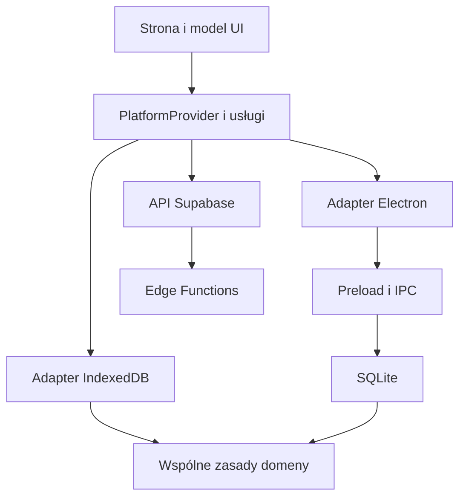

# Architektura

[English](architecture.md) | [Русский](architecture.ru.md) | **Polski**

LioraLang ma jeden interfejs i dwa lokalne mechanizmy danych: IndexedDB w przeglądarce i SQLite w Electron. Zasady fiszek, importu, SRS i synchronizacji korzystają ze wspólnego kodu, aby wyniki były spójne.

## Warstwy aplikacji

| Warstwa | Odpowiedzialność |
| --- | --- |
| `src/app/` | Start, trasy, układ i providery |
| `src/pages/` | Składanie stron |
| `src/widgets/` | Duże części stron: nauka, edytor, ustawienia, postępy |
| `src/features/` | Działania: ocena, import, dodawanie, generowanie |
| `src/entities/` | Prezentacja encji i modele UI |
| `packages/shared/src/` | Wspólne UI, konfiguracja, czysta logika, API i adaptery platform |
| `electron/` | Proces główny Electron, preload, IPC, baza i operacje systemowe |
| `supabase/` | Migracje i funkcje serwerowe |

Importy prowadzą w dół: app, pages, widgets, features, entities, shared. Moduły udostępniają API przez `index.js`. Shared nie importuje UI wyższych warstw; jego logika nie zależy od React, IndexedDB ani Electron.

Infrastruktura API i adapterów też jest w shared, ale komponenty korzystają z niej przez usługi.

## Start i wybór platformy

`src/main.jsx` uruchamia aplikację. `src/app/App.jsx` łączy środowisko i trasy. `PlatformProvider` znajduje się w `packages/shared/src/providers/PlatformProvider/`.

Vite wybiera platformę przez `VITE_APP_TARGET`. `@platform-target` wskazuje `packages/shared/src/platform/target/web.js` lub `desktop.js`. `@app-router-routes` wybiera trasy web lub desktop.

Web używa bazy `/`, desktop `./`. Web zawiera landing page, lokalizowane strony i przekierowania publicznych linków talii. Desktop zaczyna od Nauki. Wspólne strony są pod `/app/`.

## Dostęp do danych

UI używa `usePlatformService` z `@shared/providers`:

```jsx
import { usePlatformService } from "@shared/providers";

const deckRepository = usePlatformService("deckRepository");
```

Model wywołuje repozytorium i obsługuje ładowanie, wynik oraz błąd. Komponent nie musi znać bazy przechowującej wpis. [Kontrakt platform](architecture-dual-platform.pl.md) wymienia usługi.



Strzałki oznaczają wywołania i używanie zasad. Czysta logika nie wywołuje adapterów wstecz.

## Dane i przedmioty

Talia przechowuje nazwę, opis, tagi, tożsamość synchronizacji i konfigurację przedmiotu. Wpis zawiera `source`, `target`, wspólne pola i `subjectFields`. Nazwa `words` pozostaje w kodzie i bazie również dla zadań oraz pytań.

Profil określa pola, podpisy stron, kierunki, możliwości AI, dostępność Huba i układ fiszki. Rejestr to `core/usecases/subjects/registry.js`. Technologia zmienia wygląd programowania przez katalog, bez nowego typu wpisu.

`buildCardPresentation()` buduje bloki profilu; Flashcard przypisuje typy bloków do komponentów. Fiszki językowe zachowują istniejący sposób renderowania. [Rozszerzanie](learning-objects.pl.md).

## Główne przepływy

### Zapis talii

Formularz zbiera dane i normalizuje pola profilu. Repozytorium zapisuje talię i wpisy, aktualizuje tożsamość zawartości i informuje subskrybentów. Generator zapisuje nową talię i wybrane szkice jednym `saveDeck`.

### Powtórka

Repozytorium odczytuje fiszki i dziennik. Wspólna logika tworzy kolejkę i podgląd odstępów. Zapis oceny sprawdza profil i revision, potem zapisuje harmonogram oraz zdarzenie odpowiedzi w jednej transakcji. UI przechodzi dalej dopiero po udanym zapisie. [SRS](srs.pl.md).

### Synchronizacja

Wspólny `createSyncRepository` porównuje lokalne hashe z ostatnim znanym stanem serwera. Pakiety talii i obrazy są przesyłane osobno od zdarzeń powtórek. Adaptery zapisują kolejkę i stan profilu. [Dane, konflikty i odzyskiwanie](platforms-and-storage.pl.md).

### AI

UI sprawdza ustawienia, sesję i sieć, potem wywołuje `wordSuggestRepository`. Edge Function sprawdza użytkownika, limit i żądanie, wywołuje Gemini i waliduje wynik. Wynik pozostaje sugestią do zastosowania. [Kontrakty AI](word-suggestions.pl.md).

## Electron

`electron/main.js` łączy moduły z `electron/main/`. Cykl okna, menu, import, kopie, OAuth, aktualizacje i IPC są rozdzielone. `electron/preload.cjs` udostępnia ograniczone API rendererowi.

SQLite i pliki obsługuje main. Okna mają `contextIsolation` i wyłączone `nodeIntegration`. `window.electronAPI` należy do infrastruktury i adapterów, nie stron lub widgetów.

## Kompilacja i kontrole

Strony używają lazy routes. Repozytoria web SRS i postępów też ładują się na żądanie. Web build tworzy manifest zasobów dla service workera i statyczne strony przez SSR i prerender.

`check:boundaries` oraz `check:layers` sprawdzają granice importów. ESLint sprawdza kod i hooki. Zainstalowany pakiet FSD sam nie dowodzi egzekwowania zasad przez ESLint; decydują konfiguracja i skrypty.

[Środowisko i polecenia](onboarding.pl.md) · [Mapa modułów](module-catalog.pl.md) · [Zasady kodu](../rules/code-and-components-rules.pl.md)
